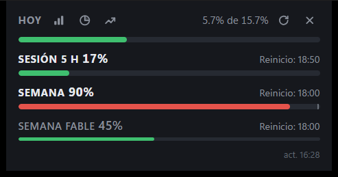
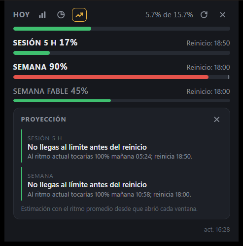

# claude-usage-widgets

Un widget siempre visible con tu uso del plan de Claude: sesión de 5 h, semana, límites por
modelo, cuánto llevas hoy contra lo que te toca, desglose de la semana y una proyección de
cuándo llegarías al límite.





| Plataforma | Estado |
|---|---|
| Windows 11 | **disponible** en [Releases](https://github.com/abelardodiaz/claude-usage-widgets/releases) |
| Android (widget y burbuja flotante) | en camino |
| Linux / macOS | planeado |

## Instalar en Windows

Requisito: tener [Claude Code](https://docs.claude.com/en/docs/claude-code) instalado y con
sesión iniciada en esta PC. El widget lee el token que Claude Code guarda en
`%USERPROFILE%\.claude\.credentials.json`; nunca lo copia ni lo renueva. Si el token vence, el
widget lo avisa y basta con abrir Claude Code.

1. Descarga `claude-usage-widgets_<versión>_x64-setup.exe` (o el `.msi`) de la página de
   [Releases](https://github.com/abelardodiaz/claude-usage-widgets/releases).
2. Revisa el checksum: `certutil -hashfile <archivo> SHA256` tiene que dar lo mismo que la línea
   de ese archivo en `SHA256SUMS.txt`, en el mismo Release.
3. Ejecuta el instalador. Se instala para tu usuario, sin permisos de administrador.
4. El widget aparece arriba a la derecha y deja un icono en la bandeja. Clic izquierdo lo muestra
   u oculta; clic derecho abre el menú: mostrar/ocultar, actualizar, iniciar con Windows, buscar
   actualizaciones y salir.

### Aviso de SmartScreen

El instalador no tiene firma de código de Windows (cuesta dinero cada año y este es un proyecto
personal), así que SmartScreen puede decir "Windows protegió su PC". Para seguir: **Más
información** y luego **Ejecutar de todas formas**. Si prefieres no hacerlo, compara antes el
checksum del paso 2. Las actualizaciones sí van firmadas: la app rechaza cualquier instalador que
no venga firmado con la llave de este proyecto.

### Datos que guarda

Las muestras del historial viven en `%LOCALAPPDATA%\io.github.abelardodiaz.claude-usage-widgets\`:
solo porcentajes y fechas, ninguna credencial. La posición de la ventana queda en
`%APPDATA%\io.github.abelardodiaz.claude-usage-widgets\`.

## Privacidad

- Tu credencial no sale de tu equipo y no se escribe en logs ni en el historial.
- El widget solo habla con `api.anthropic.com`.
- Única excepción: `github.com` y el CDN de descargas de GitHub (`*.githubusercontent.com`),
  y **solo cuando pulsas "Buscar actualizaciones"** en la bandeja. Nunca al arrancar ni cada
  cierto tiempo.
- Sin telemetría, sin analíticas, sin servidores del proyecto.

Detalles en [SECURITY.md](SECURITY.md).

## Aviso

**Proyecto no oficial, no afiliado a Anthropic.** Usa endpoints no documentados que pueden
cambiar o dejar de funcionar sin aviso. La única fuente oficial de instaladores es la página de
Releases de este repositorio.

## Desarrollo

```bash
cd desktop
pnpm install
pnpm tauri dev
cd src-tauri && cargo test
```

Diseño y planes en `docs/superpowers/`. Contrato de cálculo y fixtures en `spec/`.

## English

An always-visible widget with your Claude plan usage: 5-hour session, weekly and per-model
limits, today's budget, a weekly breakdown and a projection of when you would hit the limit.

- **Windows 11:** download the installer from
  [Releases](https://github.com/abelardodiaz/claude-usage-widgets/releases) and check it against
  `SHA256SUMS.txt`. Requires Claude Code installed and signed in; the widget only reads its
  token and never refreshes it. The installer is not code-signed, so SmartScreen may warn you:
  "More info" then "Run anyway". Updates are signed and verified by the app.
- **Android:** on the way. **Linux / macOS:** planned.
- **Privacy:** the only host is `api.anthropic.com`, plus `github.com` and
  `*.githubusercontent.com` only when you click "Check for updates" in the tray. No telemetry.
- **Unofficial project, not affiliated with Anthropic.** It uses undocumented endpoints that may
  change without notice.

Licencia MIT / MIT license.
